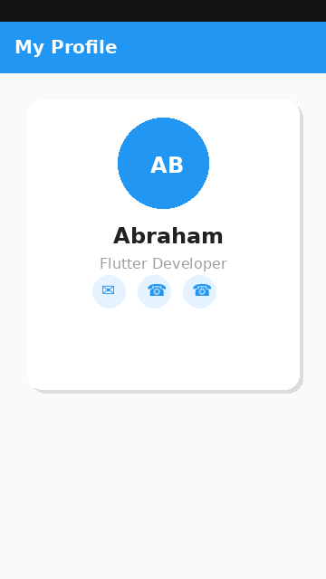
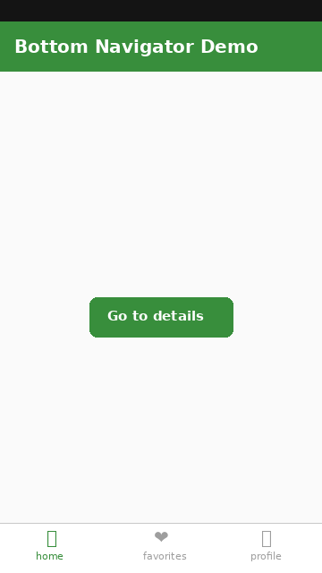
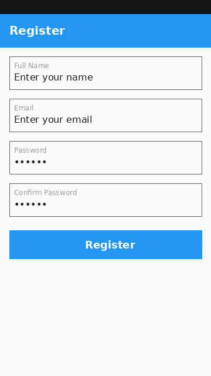
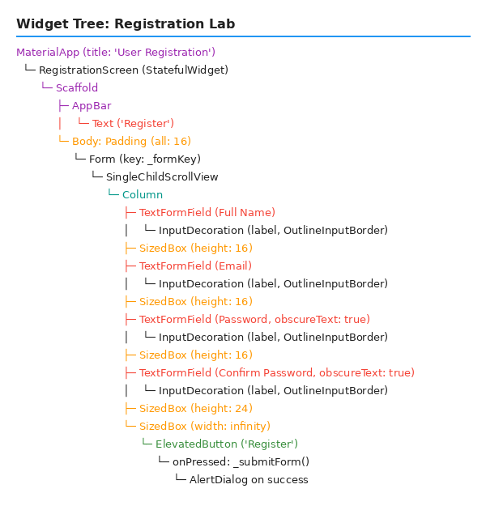

# Flutter Lab Assignments

| Name                  | ID           | Section   |
|-----------------------|--------------|-----------|
| Abraham Nigatu Kebede | UGR/7532/16  | Section 2 |

---

## Lab Projects

### 1. Profile Card

A Flutter app displaying a user profile card with a circular avatar, name, role, and contact icon buttons.

| App Screenshot | Widget Tree |
|:-:|:-:|
|  |  |

→ [View Project](profile_card/)

---

### 2. Product Catalog

A Flutter app showing a scrollable 2-column product grid with images, names, prices, and descriptions.

| App Screenshot | Widget Tree |
|:-:|:-:|
|  |  |

→ [View Project](catalog_lab/)

---

### 3. Navigation Lab

A Flutter app demonstrating bottom navigation with three tabs and stack-based routing to a Details screen.

| App Screenshot | Widget Tree |
|:-:|:-:|
|  |  |

→ [View Project](navigation_lab/)

---

### 4. Registration Lab

A Flutter user registration form with validation for name, email, password, and confirm password fields.

| App Screenshot | Widget Tree |
|:-:|:-:|
|  |  |

→ [View Project](registration_lab/)
