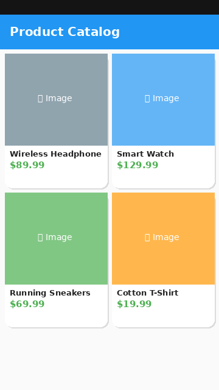

# Product Catalog

A Flutter app showing a scrollable 2-column grid of products, each with an image, name, price, and description.

## Screenshot

## Widget Tree

## Description

This lab demonstrates Flutter list and grid widgets:
- `GridView.builder` with `SliverGridDelegateWithFixedCrossAxisCount` for a 2-column product grid
- `Card` with rounded corners and elevation for each product tile
- `Image.network` with `errorBuilder` and `loadingBuilder` callbacks
- `ClipRRect` for rounded image corners
- `Column` and `Text` widgets for product details
- `StatefulWidget` holding a list of `Product` data objects
